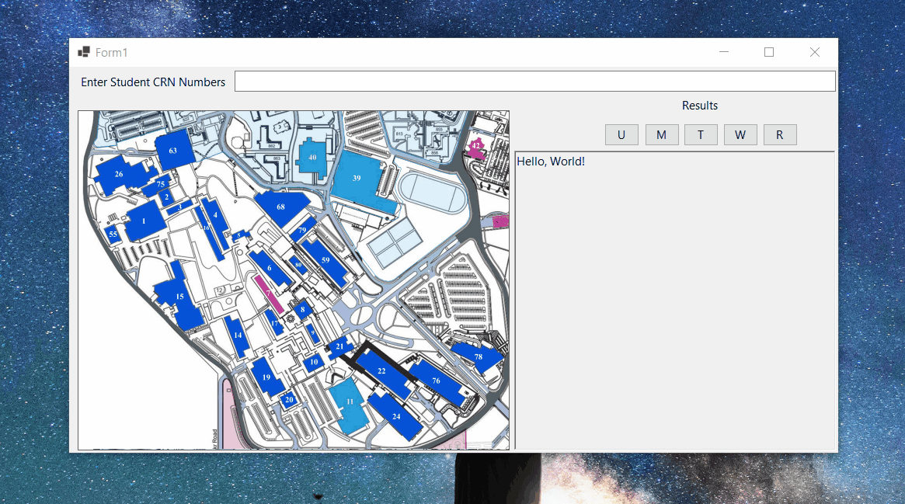

# Classes Map Visualizer

<!-- [](https://github.com/Mo-Moallem/FileVisualizer/stargazers) -->

<!--[](LICENSE)-->


A small Windows Forms (.NET 9) application that parses an Excel file including data about different sections of different classes and, given their CRNs (ID for a section or different sections that are strictly enrolled with each other), visualizes an approximate map of the different buildings you need to go through on a specific day.

## Demo



## Why this project is useful

* Helps choose classes and sections to enroll in by comparing different combinations and their paths at the university.

## Features

* Reads an Excel file of 3,717 rows and 13 columns and parses it in 1,333 ms.
* Instance visualization and data access using a hashtable.

## Quick start

1. Clone the repository

   ```
   git clone https://github.com/Mo-Moallem/CourseManager
   ```

2. Open in Visual Studio

3. Change the directory in the `DataReader.cs` class

   ```
   xWorkBook = xApp.Workbooks.Open(@"CHANGE THIS", ReadOnly: true);
   ```

4. Run
